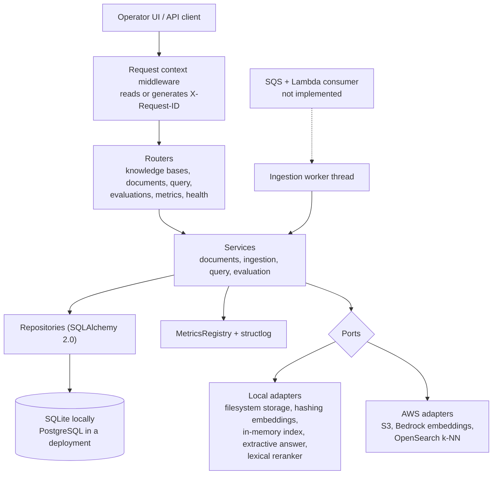
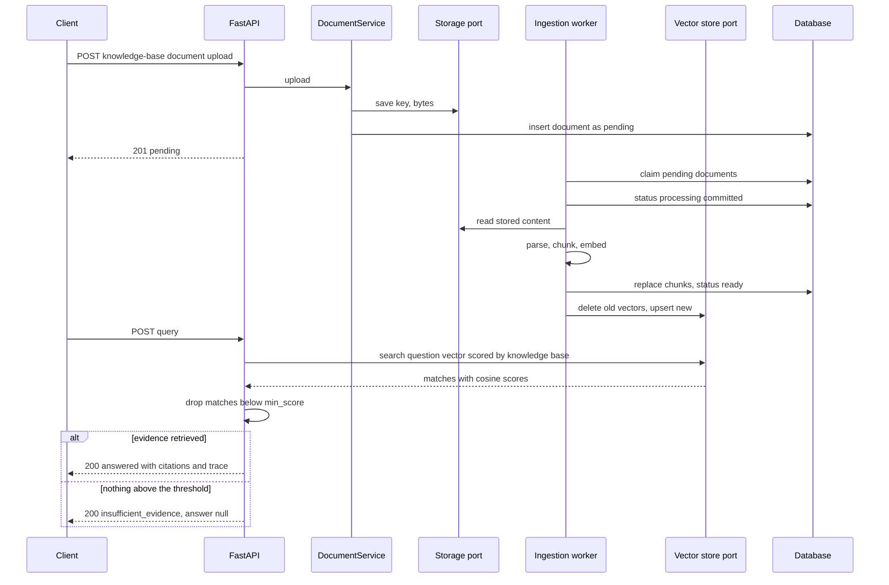
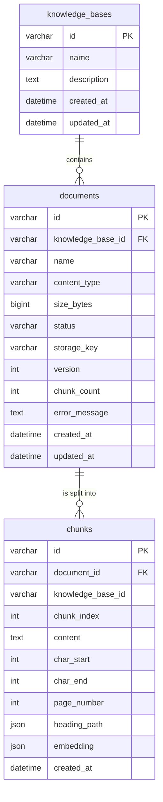

# AWS Enterprise RAG Platform

企业内部知识库检索增强问答平台
Enterprise Knowledge Retrieval-Augmented Answering Platform

围绕企业自有的运维手册、安全策略与流程文档，构建可检索、可引用、可度量的问答后端。检索不到证据时平台明确拒答，而不是让模型猜测。

A retrieval-augmented answering backend for an organisation's own runbooks, security policies and process documents. Answers are grounded in retrieved passages and carry citations; when retrieval finds nothing above the configured threshold, the platform refuses to answer instead of guessing.

## 项目简介 | Overview

AWS Enterprise RAG Platform 是一个企业内部知识库问答后端系统。

系统围绕「知识库 - 文档 - 段落 - 检索 - 引用」构建核心链路，为企业内部文档检索与问答提供统一后端服务。项目重点关注 RAG 工程中的检索质量可测量性、引用可追溯性、无证据时拒答、摄取流水线的幂等与可恢复性、本地适配器与 AWS 适配器的可替换性，以及可测试性。

当前实现完整覆盖本地可运行链路（摄取、检索、回答、引用、追踪、指标、评估、前端界面），并已完成 S3、Bedrock 嵌入、OpenSearch k-NN 三个 AWS 适配器；基础设施即代码、队列消费者与身份认证尚未实现，见 [项目边界](#项目边界--project-scope)。

AWS Enterprise RAG Platform is an internal knowledge-base question-answering backend.

The system is built around the flow of knowledge bases, documents, passages, retrieval and citations. It provides a unified backend for internal document search and answering, with emphasis on measurable retrieval quality, traceable citations, refusing to answer when no evidence is retrieved, idempotent and recoverable ingestion, swappable local and AWS adapters, and testability.

The local path is complete and runnable end to end (ingestion, retrieval, answering, citations, traces, metrics, evaluation and an operator UI). Three AWS adapters are implemented: S3, Bedrock embeddings and OpenSearch k-NN. Infrastructure as code, a queue consumer and authentication are not implemented; see [Project Scope](#项目边界--project-scope).

## 项目背景 | Business Background

企业内部知识通常散落在运维手册、安全策略、事故复盘和流程文档中。员工提问时面对的问题不是「搜不到」，而是「搜到了但不知道该信哪一条」：命中的段落是否真的回答了问题、答案出自哪份文档、哪一段、系统在没有任何依据时会不会编一个答案。

传统关键词检索解决的是召回，RAG 后端还必须解决另外三件事：检索结果是否达到可用阈值、答案能否追溯到具体段落、无法回答时是否明确拒答。同时，企业部署环境要求同一套代码既能在本地零依赖运行（开发、评审、CI），也能切换到 AWS 托管服务（S3、Bedrock、OpenSearch），而不需要修改业务代码。

AWS Enterprise RAG Platform 围绕这些需求构建了 `knowledge_bases`、`documents`、`chunks` 三个核心模型，并把存储、嵌入、向量索引、生成四类能力抽象为端口（port）。当前项目聚焦文档问答闭环，不包含文档协作、权限体系或完整搜索平台功能。

Internal knowledge is usually scattered across runbooks, security policies, incident reviews and process documents. The problem for a user is not only finding something, but knowing whether the retrieved passage actually answers the question, which document and section it came from, and whether the system will invent an answer when it has no evidence.

Keyword search addresses recall. A RAG backend must also address three further things: whether retrieval cleared a usable threshold, whether an answer can be traced back to a specific passage, and whether the system explicitly refuses when it cannot answer. At the same time, a deployment must run the same code locally with no external dependencies (for development, review and CI) and switch to managed AWS services (S3, Bedrock, OpenSearch) without changing business logic.

The platform addresses these requirements through the `knowledge_bases`, `documents` and `chunks` models, and by putting storage, embeddings, the vector index and generation behind ports. The scope is document question answering, not document collaboration, access control or a full search platform.

## 核心功能 | Features

**平台基础**

- 配置系统：Pydantic Settings 从 `APP_*` 环境变量与 `.env` 读取，非法值在启动时即失败。
- 结构化日志：structlog 输出 JSON（生产）或 console（本地阅读）。
- Request ID：读取或生成 `X-Request-ID`，写入响应头、日志与回答的 trace。
- 统一错误处理：所有失败返回同一信封 `{request_id, error:{code,message,details}}`。
- 健康检查：`/health` 存活探针与 `/health/ready` 就绪探针（含数据库检查）。

**知识库与文档**

- 知识库 CRUD：创建、列表、详情、删除（删除级联清理文档、段落、存储对象与向量）。
- 文档上传：multipart 上传，按扩展名选择解析器（PDF / Markdown / TXT），限制大小。
- 文档状态机：`pending → processing → ready | failed`，失败原因写入 `error_message`。
- 段落查看：查看文档被切分后的实际段落、页码与标题路径。
- 重新摄取：`reprocess` 丢弃旧段落与旧向量后重新排队，是失败文档的恢复路径。

**摄取流水线**

- 解析：pypdf 抽取 PDF 文本，Markdown/TXT 保留结构（标题层级）。
- 切分：按字符窗口切分并保留重叠，记录 `char_start`、`char_end`、`heading_path`、`page_number`。
- 嵌入：默认本地词汇哈希模型，可切换 Bedrock Titan Text Embeddings V2。
- 索引：默认进程内向量索引，可切换 OpenSearch k-NN。
- 幂等：重新摄取会先替换该文档的全部段落与向量，重复投递不会产生重复数据。
- 可恢复：启动时把崩溃遗留的 `processing` 文档放回 `pending`。

**查询与引用**

- 检索：按知识库隔离，取 `top_k` 候选并计算余弦相似度。
- 阈值策略：低于 `min_score` 的候选不作为证据，策略定义在余弦尺度上。
- 重排：`Reranker` 端口存在并有本地实现，但默认关闭（测量结论见下）。
- 生成：默认本地提取式回答（逐字引用段落），可切换 Bedrock Nova。
- 引用：每条引用包含文档名、段落序号、页码、标题路径、分数与片段。
- 拒答：无证据时返回 `insufficient_evidence` 且 `answer` 为 `null`，不生成任何内容。
- 追踪：每次回答返回 `trace`，包含候选数、过阈值数、上下文规模与各阶段耗时。

**可观测性与评估**

- 指标：请求计数、按路由模板的计数、摄取/查询/检索计数与各阶段延迟分位数。
- 评估：上传带标注的数据集，返回 recall@k、precision@k、hit rate、MRR、nDCG、引用准确率/召回率与逐题明细。

**前端界面**

- React + TypeScript 操作台：知识库列表与详情、文档与段落查看、问答面板（含 trace 与引用）、评估页、指标页。
- 开发代理：Vite 开发服务器把 `/api` 与 `/health` 代理到后端，部署时由反向代理承担同一职责。

English summary:

- Pydantic Settings configuration, structured JSON logging, request-id correlation, one error envelope and liveness/readiness probes.
- Knowledge base CRUD with cascading cleanup of documents, passages, stored objects and vectors.
- Document upload with per-format parsing, an explicit status machine and a reprocess recovery path.
- Ingestion pipeline: parse, structure-preserving chunking, embeddings, indexing, idempotent re-ingestion and startup recovery of interrupted work.
- Query pipeline: knowledge-base-scoped retrieval, a cosine-scale relevance threshold, an optional reranker port, grounded answers with citations, and an explicit `insufficient_evidence` outcome with no answer text.
- Observability: counters and per-stage latency percentiles, plus an evaluation module scoring retrieval and citation quality against labelled datasets.
- A React operator UI for knowledge bases, documents, passages, answering, evaluation and metrics.

## 技术栈 | Tech Stack

| Layer | Technology |
| --- | --- |
| Language | Python 3.12, TypeScript 7 |
| Backend framework | FastAPI, Pydantic v2, pydantic-settings |
| Persistence | SQLAlchemy 2.0 (synchronous), SQLite locally, PostgreSQL in a deployment |
| Document parsing | pypdf, custom Markdown/TXT structure parser |
| Embeddings | Local hashing embedder (default), Amazon Bedrock Titan Text Embeddings V2 |
| Vector index | In-process index (default), OpenSearch k-NN |
| Generation | Local extractive generator (default), Amazon Bedrock (Nova) |
| AWS SDKs | boto3 (S3, Bedrock Runtime), opensearch-py |
| Observability | structlog (JSON/console), in-process MetricsRegistry |
| Frontend | React 19, React Router 7, Vite 8, TypeScript 7 |
| Testing | pytest, ruff (backend); vitest, Testing Library, tsc (frontend) |
| Infrastructure | Terraform and docker-compose are planned, not present |

## 系统架构 | Architecture

端口与适配器（ports and adapters）：业务服务只依赖端口，具体实现由环境变量在唯一一处选择。



四个端口分别是 `DocumentStorage`、`EmbeddingModel`、`VectorStore`、`AnswerModel`（`Reranker` 是第五个，默认不启用）。它们都是 `runtime_checkable` 的 `Protocol`，因此适配器不需要继承任何基类，测试可以直接断言结构一致性。

适配器的选择集中在 `app/adapters.py`，由 `create_app` 调用；服务层没有任何一处判断自己运行在本地还是 AWS。

更多设计说明见 [docs/architecture/decisions](./docs/architecture/decisions)。



## 数据模型 | Data Model

数据库由三张业务表组成。SQLite 用于本地运行，字段类型与 PostgreSQL 兼容。



关键约束与不变量：

- `documents.status` 只有四个取值：`pending`、`processing`、`ready`、`failed`；只有 `ready` 的文档会出现在检索结果中。
- `chunks` 通过 `ON DELETE CASCADE` 跟随文档删除；`knowledge_base_id` 在段落上冗余存储，使检索可以按知识库过滤而不需要联表。
- `chunks.embedding` 以 JSON 存储，向量维数由 `APP_EMBEDDING_DIMENSIONS` 决定；换模型必须重新摄取。
- `knowledge_bases.name` 的唯一性由服务层保证，当前没有数据库级唯一约束。
- 摄取顺序是「先提交段落，再更新索引」，因此向量不会指向一条读不到的记录；代价是存在一个很短的窗口，文档已显示 `ready` 但尚未可检索。

English summary: three tables, a four-state document status where only `ready` is retrievable, cascade deletion of passages, embeddings stored as JSON at the configured width, knowledge-base name uniqueness enforced in the service layer, and chunks committed before the index is updated.

## 核心业务流程 | Core Business Flow

上传到可检索的完整链路：

1. 客户端上传文件，服务把内容写入存储端口，并在同一个事务内插入 `pending` 文档。
2. 摄取线程领取 `pending` 文档，先把 `processing` 提交，再解析、切分、嵌入。
3. 段落替换与 `ready` 状态在同一事务内提交；随后删除旧向量并写入新向量。
4. 任何一步失败都会把文档置为 `failed`、清空段落与向量、写入 `error_message`，不会留下半成品。
5. 查询时嵌入问题、按知识库检索候选、丢弃低于 `min_score` 的候选、构造上下文并要求生成器只依据上下文回答，最后返回引用与 trace。

第 2 步与第 3 步之间进程崩溃时，文档会停留在 `processing`；下一次启动的 `recover_interrupted` 会把它放回 `pending`，这是本地单进程部署的恢复机制。

English summary: upload commits a pending document, the worker commits `processing` before parsing, chunks and `ready` are committed together, the index is updated afterwards, failures clear passages and vectors, and a crash mid-ingestion is recovered at the next startup.

## 检索质量与回答质量 | Retrieval & Answer Quality

这是本项目最重要的一节，因为它决定了系统能宣称什么、不能宣称什么。

默认嵌入模型是**本地词汇哈希模型**，它度量的是词面重合度，不是语义相似度。这一点不是推测，而是用真实运行测出来的：`evaluation/datasets/sample.json` 是 5 篇运维手册、5 个可回答问题（标注引用原文片段）、1 个语料中不存在答案的问题（公司假期安排）。真实运行中每道题的最佳候取得分：

| question | answerable | best candidate score |
| --- | --- | --- |
| encryption-at-rest | yes | 0.6940 |
| sev1-acknowledgement | yes | 0.6080 |
| snapshot-retention | yes | 0.5015 |
| production-access-approval | yes | 0.4186 |
| **holiday-schedule** | **no** | **0.3146** |
| credential-rotation | yes | **0.2578** |

**不相关的问题得分高于一个真正相关的问题**，因此在默认阈值下它被回答了：`unanswerable_abstained` 为 `0.0`。这不是评测器的缺陷，也不是阈值没调好：分数度量的是共享词汇，虚词也是共享词汇，而两个区间重叠，所以不存在能把它们分开的阈值。

阈值仍然可以移动这个权衡。同一数据集在 `min_score = 0.35` 下：

| | 默认 0.1 | 0.35 |
| --- | --- | --- |
| `answerable_answered` | 1.0 | 0.8 |
| `unanswerable_abstained` | 0.0 | 1.0 |
| `citation_precision` | 0.26 | 0.875 |
| `recall_at_k` | 1.0 | 0.8 |

用这个模型，可以拒答不相关问题，但无法在不误伤一个可回答问题的前提下做到。阈值真正买到的是更干净的引用，因为更高的阈值把不相关段落挡在上下文之外。

有两个结论**不能**从这里推出。第一，这不代表平台会编造答案：`insufficient_evidence` 是在没有候选过阈值时到达的，而在提取式生成器下，一个假阳性是一条逐字引用但没有回答问题的段落。第二，这不代表换成生成式模型后行为相同 —— 不相关的上下文正是模型可能给出无依据答案的输入，这正是回答里要报告 `answer_kind` 的原因，也是相关推理写在 [ADR 0005](./docs/architecture/decisions/0005-observability-and-evaluation.md) 的原因。要缩小这个差距需要语义嵌入并重新测量，而不是换一个默认值。

重排器是这份数据无法判定的另一件事。`APP_RERANK_ENABLED=true` 在同一个样本上返回逐位相同的数字（`recall_at_k 1.0`、`mrr 1.0`、`ndcg_at_k 1.0`、`citation_precision 0.26`），因为未重排的基线已经把相关段落排在第一，重排没有可恢复的空间。这是一个**无结论**的测量，不是正面结论，所以重排器保持关闭。

**本仓库不宣称任何超出本页数字的质量指标。** 本页数字描述的是一个 6 题样本。没有任何忠实度、groundedness 或幻觉率指标 —— 判断一段自然语言回答是否忠实需要人工或模型判断，这里没有任何启发式指标冒充它。

English summary: the default embedder measures shared vocabulary, not meaning. Measured on the committed sample, an unrelated question outscores a relevant one (0.3146 vs 0.2578), so no threshold separates them; a higher threshold trades answerable coverage for abstention and cleaner citations. The reranker measurement is inconclusive and the reranker stays off. No faithfulness metric is claimed anywhere.

## 相关性阈值与无证据契约 | Threshold Policy & the No-Evidence Contract

`APP_RETRIEVAL_MIN_SCORE` 是定义在**余弦尺度 [-1, 1]** 上的策略，不是某个后端的实现细节。

- 阈值在检索之后、生成之前执行，低于阈值的候选不会进入上下文。
- 没有任何候选过阈值时，平台返回 `outcome = "insufficient_evidence"`、`answer = null`、`citations = []`。这是平台唯一能承诺的「不编造」保证：没有证据时不产生任何内容，而不是「模型一定服从提示词」。
- OpenSearch 的 `cosinesimil` 返回 `(1 + cos) / 2`（正交为 0.5 而不是 0），适配器会换算回余弦，`space_type` 因此不作为配置项暴露。这样做是为了让同一个阈值在任何索引后端含义一致；换距离度量必须同时改适配器和策略，必须是有意为之。
- 阈值与嵌入模型绑定。换模型（尤其是换成语义嵌入）必须重新测量阈值，不能沿用旧值。

English summary: `min_score` is a policy on the cosine scale, applied after retrieval and before generation. OpenSearch's `(1 + cos) / 2` score is converted back by the adapter so one threshold means one thing on any backend; the distance metric is deliberately not configurable. When nothing clears the threshold the platform returns `insufficient_evidence` with no answer text — the guarantee is that no content is produced without evidence, not that a model always obeys its prompt.

## 引用与可追溯性 | Citations & Traceability

每条引用都指向一个真实存在的段落，而不是一段文本：

```json
{
  "marker": 1,
  "document_id": "3a7d9c1e5b2f4a8c9d0e1f2a3b4c5d6e",
  "document_name": "incident-response.md",
  "chunk_id": "b1c2d3e4f5a60718293a4b5c6d7e8f90",
  "chunk_index": 2,
  "page_number": null,
  "heading_path": ["Encryption policy", "Credential rotation"],
  "score": 0.369274,
  "rerank_score": null,
  "snippet": "Credential rotation Database credentials rotate every ninety days…"
}
```

- `chunk_id` 可以直接通过 `GET /api/v1/knowledge-bases/{id}/documents/{document_id}/chunks` 核对，引用可以回到原文。
- `answer_kind` 说明答案由谁产生：`extractive` 表示本地提取式生成的逐字引用，模型生成的答案会有不同的取值，调用方不需要猜。
- `trace` 让「为什么拒答」可诊断：`candidates`、`above_threshold`、`used`、`min_score`、`missing_chunks` 与各阶段耗时都在里面。
- 摄取顺序保证向量永远指向一条已提交的段落，因此引用不会解析失败。

English summary: every citation resolves to a stored passage with its document, index, page, heading path and score, so a claim can be checked against the source. `answer_kind` says whether a model wrote the answer, and the trace explains why a question was refused.

## 可观测性 | Observability

每个请求产生一条访问日志，同一请求的所有记录携带相同的 `request_id`：

```json
{"event": "request_completed", "http_method": "POST",
 "http_path": "/api/v1/knowledge-bases", "http_status": 201, "duration_ms": 3.914,
 "request_id": "demo-123", "level": "info", "logger": "app.api.middleware",
 "timestamp": "2026-01-01T09:30:00.000000Z"}
```

摄取成功记录做了什么，失败记录完整堆栈：

```json
{"event": "document_ingested", "document_id": "3a7d…", "knowledge_base_id": "0f4c…",
 "parser": "markdown", "chunk_count": 4, "notes": [], "level": "info",
 "logger": "app.services.ingestion", "timestamp": "2026-01-01T09:31:12.140000Z"}
```

回答记录检索找到了什么、哪个适配器回答、时间花在哪里：

```json
{"event": "query_answered", "knowledge_base_id": "0f4c…", "citations": 1,
 "generator": "extractive-local", "generator_kind": "extractive",
 "retrieval_ms": 1.797, "generation_ms": 0.009, "total_ms": 2.047, "level": "info",
 "logger": "app.services.query", "timestamp": "2026-01-01T09:31:13.200000Z"}
```

拒答不是失败，因此以 info 级别记录（`query_insufficient_evidence`）并带上解释原因的各项计数。服务端失败（5xx）带原因链记录，因此 `502 GENERATION_FAILED` 会记录上游实际返回了什么；客户端失败（4xx）是警告且不带堆栈，因为被拒绝的请求不是本服务的缺陷。

### `GET /api/v1/metrics` 的真实输出

以下是在一次真实运行（完整评估数据集跑两次：默认阈值与 0.35）之后抓取的快照：

```json
{
  "window": 1024,
  "counters": {
    "evaluation.questions.total": 12,
    "evaluation.runs": 2,
    "http.requests.total": 4,
    "http.responses.2xx": 3,
    "http.route./evaluations": 2,
    "http.route./health": 1,
    "ingestion.chunks.total": 38,
    "ingestion.succeeded": 10,
    "query.answered": 10,
    "query.insufficient_evidence": 2,
    "retrieval.candidates.total": 60,
    "retrieval.selected.total": 32
  },
  "latencies": {
    "evaluation": {"observed": 2, "retained": 2, "mean_ms": 22.206, "p50_ms": 19.404, "p95_ms": 25.007, "max_ms": 25.007},
    "generation": {"observed": 10, "retained": 10, "mean_ms": 0.004, "p50_ms": 0.004, "p95_ms": 0.007, "max_ms": 0.007},
    "http.request": {"observed": 3, "retained": 3, "mean_ms": 20.227, "p50_ms": 20.971, "p95_ms": 36.324, "max_ms": 36.324},
    "ingestion": {"observed": 10, "retained": 10, "mean_ms": 1.954, "p50_ms": 1.565, "p95_ms": 3.759, "max_ms": 3.759},
    "query": {"observed": 12, "retained": 12, "mean_ms": 0.647, "p50_ms": 0.594, "p95_ms": 1.271, "max_ms": 1.271},
    "retrieval": {"observed": 12, "retained": 12, "mean_ms": 0.550, "p50_ms": 0.515, "p95_ms": 1.101, "max_ms": 1.101}
  }
}
```

读这些数字时需要注意四点：

- **计数按路由模板打标，不带 API 版本前缀。** `/api/v1/knowledge-bases/{id}/documents` 记为 `http.route./knowledge-bases/{knowledge_base_id}/documents`。调用方无法通过编造标识符产生新的指标序列，未匹配请求共享一个 `http.route.unmatched` 桶，修改 `APP_API_V1_PREFIX` 也不会拆散所有计数。
- **没有执行过的阶段没有延迟样本，而不是 0。** 这里 `generation` 有 10 个样本而不是 12 个：两次 `insufficient_evidence` 从未到达生成器。新进程里延迟字典是空的，这才是「什么都还没发生」的样子。
- **分位数是最近 1024 个样本上的最近秩（nearest-rank）。** `observed` 是总采样数，`retained` 是实际参与统计的数量，`window` 是上限。这些数字是**单进程**的：不跨副本聚合，重启即丢失，跨副本聚合是部署侧 CloudWatch 的职责。
- **读取指标的那个请求会出现在 `http.requests.total` 里，但还没有对应的响应计数**，因为响应是在快照之后才记录的。这一点由测试断言，而不是留给使用者去发现。

English summary: one access record per request carrying a shared `request_id`, ingestion and query events with their measurements, refusal logged as information, server-side failures with their cause chain, and counters labelled by route template. A stage that never ran has no latency sample rather than a zero, percentiles are nearest-rank over a bounded per-process window, and nothing is aggregated across replicas or persisted across restarts.

## 评估 | Evaluation

`POST /api/v1/evaluations` 把一个带标注的数据集灌入临时知识库、逐题提问、评分，然后删除这个临时知识库。它度量的是检索与引用，不是回答的文笔。

| 指标 | 含义 |
| --- | --- |
| `recall_at_k` | 标注的相关段落有多少被检索到 |
| `precision_at_k` | 检索结果中相关段落的占比（分母是 `k`） |
| `hit_rate_at_k` | 至少命中一个相关段落的问题占比 |
| `mrr` | 第一个相关段落的排名倒数均值 |
| `ndcg_at_k` | 考虑排序位置的折扣累计增益 |
| `answerable_answered` | 可回答问题被回答的比例 |
| `unanswerable_abstained` | 不可回答问题被正确拒答的比例 |
| `citation_precision` / `citation_recall` | 引用中命中标注段落的比例 / 标注段落被引用的比例 |

- 数据集会在任何实际工作开始之前做一致性校验：标注指向不存在的文档、可回答问题没有标注、不可回答问题有标注、文档或问题重名，都会返回 `422 INVALID_EVALUATION_DATASET` 并指出具体是哪一个。
- `issues` 报告的是数据集问题而不是平台失败：标注片段没有匹配到任何段落，或某个文档摄取失败（例如扫描版 PDF 抽不出文本）。无法解析的标注会让该题不进入聚合，而不是记 0 分。
- 标注意义上的相关性只能这样表达：标签是二值的，没有分级相关性；每次运行的结果直接返回而不落库，因此比较两次运行需要调用方自己保存响应。
- 评估是同步且有上限的：最多 25 个文档、100 个问题、每个文档 100 000 字符。真实语料需要批处理作业与进度上报，当前没有。
- 评估过程不向外发送任何内容：语料灌入本地知识库、提问、删除、返回报告。

English summary: the evaluation endpoint ingests a labelled dataset into a temporary knowledge base, scores retrieval and citation quality per question, and deletes the knowledge base afterwards. Datasets are validated before any work happens, dataset problems are reported separately from platform failures, labels are binary, and the endpoint is synchronous and capped.

## 本地适配器与 AWS 适配器 | Local and AWS Adapters

同一套服务代码运行在两种后端之上，切换只发生在配置层：

| 端口 | 本地实现（默认） | AWS 实现 |
| --- | --- | --- |
| `DocumentStorage` | `LocalFileSystemStorage` | `S3DocumentStorage`（boto3，按前缀存放） |
| `EmbeddingModel` | `HashingEmbeddingModel`（词汇哈希，256 维） | `BedrockEmbeddingModel`（Titan Text Embeddings V2） |
| `VectorStore` | `InMemoryVectorStore`（暴力精确检索） | `OpenSearchVectorStore`（k-NN，HNSW，cosinesimil） |
| `AnswerModel` | `ExtractiveAnswerModel`（逐字引用） | `BedrockAnswerModel`（Nova） |
| `Reranker` | `LexicalOverlapReranker`（默认关闭） | 无（重排仍走本地实现或关闭） |

设计要点：

- **本地默认零外部依赖。** 不装 boto3、不配凭证也能完整运行，这是评审、CI 与本地开发的默认路径。
- **SDK 延迟导入。** `boto3` 与 `opensearchpy` 只在构造客户端时导入；每个适配器都接受注入的客户端，因此请求与响应映射可以在没有 AWS 账号的情况下被测试钉住。缺少依赖时报错会指出该改哪个配置：
  `the S3 storage adapter needs the AWS SDK: install the 'aws' extra (pip install -e '.[aws]') or set APP_STORAGE_BACKEND=local`
- **配置不可用就在启动时失败。** `APP_STORAGE_BACKEND=s3` 缺 bucket、OpenSearch 缺 endpoint、basic-auth 只给一半，都会让进程在启动阶段带着指名缺失项的错误退出，而不是启动后在第一次上传时才失败。这一行为已由真实运行验证（退出码 1）。
- **上游失败映射为 502。** `EMBEDDING_FAILED`、`VECTOR_STORE_ERROR`、`GENERATION_FAILED`、`STORAGE_ERROR` 都是 502：上游服务失败是网关错误，不是本服务的内部故障。已由真实运行验证：把向量后端指向一个关闭的端口，查询返回 `HTTP 502 / VECTOR_STORE_ERROR`，摄取把文档记为 `failed` 并附原因，worker 不崩溃。
- **向量维数由一处决定。** `APP_EMBEDDING_DIMENSIONS` 同时决定嵌入请求的维数与索引映射的维数，两者不可能不一致；代价是换模型必须重新摄取，当前没有任何迁移逻辑。

配置项、IAM 权限、Serverless 差异与「已验证 / 未验证」清单见 [docs/deployment/aws.md](./docs/deployment/aws.md)，决策记录见 [ADR 0007](./docs/architecture/decisions/0007-aws-adapters.md)。

English summary: five ports with a local and (where applicable) an AWS implementation, selected in one composition-root module. The local stack imports no AWS SDK and needs no credentials; SDK imports are deferred and clients are injectable so the mapping is tested against stubs; an unusable configuration fails at startup; provider failures map to 502; and the embedding width is a single setting shared by the embedder and the index.

## API 示例 | API Examples

以下示例均为可复制的真实请求。先启动服务（见 [本地运行](#本地运行--local-development)）。

### 创建知识库 | Create a knowledge base

```bash
curl -s -X POST http://127.0.0.1:8000/api/v1/knowledge-bases \
  -H 'Content-Type: application/json' \
  -d '{"name": "platform-runbooks", "description": "Internal operations runbooks"}'
```

### 上传文档 | Upload a document

```bash
KB_ID=<knowledge-base-id>
curl -s -X POST "http://127.0.0.1:8000/api/v1/knowledge-bases/$KB_ID/documents" \
  -F "file=@docs/deployment/aws.md"
```

文档以 `pending` 返回。摄取由 worker 完成，轮询这个接口即可看到 `ready` 或 `failed`：

```bash
curl -s "http://127.0.0.1:8000/api/v1/knowledge-bases/$KB_ID/documents/<document-id>"
```

### 查看被索引的段落 | Inspect the indexed passages

```bash
curl -s "http://127.0.0.1:8000/api/v1/knowledge-bases/$KB_ID/documents/<document-id>/chunks"
```

### 提问 | Ask a question

```bash
curl -s -X POST "http://127.0.0.1:8000/api/v1/knowledge-bases/$KB_ID/query" \
  -H 'Content-Type: application/json' \
  -d '{"question": "How often do database credentials rotate?"}'
```

```json
{
  "knowledge_base_id": "0f4c1b2a8d5e4f6b9c3a1d2e7f8b0c11",
  "question": "How often do database credentials rotate?",
  "outcome": "answered",
  "answer": "[1] Credential rotation\n\nDatabase credentials rotate every ninety days through Secrets Manager.",
  "answer_kind": "extractive",
  "citations": [
    {
      "marker": 1,
      "document_id": "3a7d9c1e5b2f4a8c9d0e1f2a3b4c5d6e",
      "document_name": "incident-response.md",
      "chunk_id": "b1c2d3e4f5a60718293a4b5c6d7e8f90",
      "chunk_index": 2,
      "page_number": null,
      "heading_path": ["Encryption policy", "Credential rotation"],
      "score": 0.369274,
      "rerank_score": null,
      "snippet": "Credential rotation Database credentials rotate every ninety days…"
    }
  ],
  "usage": {"input_tokens": null, "output_tokens": null},
  "trace": {
    "request_id": "58b024b94a3f4d2388ba5572a0acdcfe",
    "retrieval": {
      "candidates": 3, "above_threshold": 3, "used": 1, "top_k": 5,
      "min_score": 0.1, "reranked": false, "reranker": null,
      "missing_chunks": 0, "duration_ms": 1.797
    },
    "context": {"chars": 472, "passages": 1, "skipped": 2, "truncated": false},
    "generation": {"model": "extractive-local", "kind": "extractive", "duration_ms": 0.009},
    "total_duration_ms": 2.047
  }
}
```

没有任何候选过阈值时，回答是这个样子 —— 明确拒答，而不是猜测：

```json
{"outcome": "insufficient_evidence", "answer": null, "answer_kind": null,
 "citations": [], "usage": {"input_tokens": null, "output_tokens": null},
 "trace": {"retrieval": {"candidates": 3, "above_threshold": 0, "min_score": 0.1}}}
```

### 运行评估 | Measure retrieval and answers

```bash
curl -s -X POST http://127.0.0.1:8000/api/v1/evaluations \
  -H 'Content-Type: application/json' \
  --data-binary @evaluation/datasets/sample.json
```

```json
{
  "dataset": "platform-runbooks-smoke",
  "temporary_knowledge_base_id": "b304307e60ed472eb566b34dbca08444",
  "k": 5, "min_score": 0.1,
  "documents": 5, "chunks": 19, "total_questions": 6,
  "answerable": 5, "unanswerable": 1,
  "retrieval": {"questions": 5, "k": 5, "recall_at_k": 1.0, "precision_at_k": 0.2,
                "hit_rate_at_k": 1.0, "mrr": 1.0, "ndcg_at_k": 1.0},
  "answers": {"answered": 6, "insufficient_evidence": 0, "answerable_answered": 1.0,
              "unanswerable_abstained": 0.0, "citation_precision": 0.26, "citation_recall": 1.0},
  "issues": []
}
```

`precision_at_k` 为 `0.2` 是定义使然而不是检索问题（每题只有一个标注相关段落，而分母是 `k = 5`），`unanswerable_abstained` 为 `0.0` 是关于本地模型的真实发现，见 [检索质量与回答质量](#检索质量与回答质量--retrieval--answer-quality)。

换一个更严格的阈值再跑一次，可以看到这个策略的代价与收益：

```bash
python -c "import json;d=json.load(open('evaluation/datasets/sample.json'));d['min_score']=0.35;print(json.dumps(d))" \
  | curl -s -X POST http://127.0.0.1:8000/api/v1/evaluations \
      -H 'Content-Type: application/json' --data-binary @-
```

### 指标 | Metrics

```bash
curl -s http://127.0.0.1:8000/api/v1/metrics
```

### 接口一览 | Endpoints

| Method | Path | Purpose |
| --- | --- | --- |
| `GET` | `/` | Service metadata |
| `GET` | `/health` | Liveness |
| `GET` | `/health/ready` | Readiness, includes the database |
| `POST` | `/api/v1/knowledge-bases` | Create a knowledge base |
| `GET` | `/api/v1/knowledge-bases` | List knowledge bases |
| `GET` | `/api/v1/knowledge-bases/{id}` | Get one knowledge base |
| `DELETE` | `/api/v1/knowledge-bases/{id}` | Delete it and everything under it |
| `POST` | `/api/v1/knowledge-bases/{id}/documents` | Upload (`multipart`, field `file`) |
| `GET` | `/api/v1/knowledge-bases/{id}/documents` | List documents |
| `GET` | `/api/v1/knowledge-bases/{id}/documents/{document_id}` | Document metadata and status |
| `GET` | `/api/v1/knowledge-bases/{id}/documents/{document_id}/chunks` | Indexed passages |
| `POST` | `/api/v1/knowledge-bases/{id}/documents/{document_id}/reprocess` | Re-ingest |
| `DELETE` | `/api/v1/knowledge-bases/{id}/documents/{document_id}` | Delete a document |
| `POST` | `/api/v1/knowledge-bases/{id}/query` | Ask a question |
| `POST` | `/api/v1/evaluations` | Run a labelled dataset |
| `GET` | `/api/v1/metrics` | Counters and latency summaries |

OpenAPI 文档在 `http://127.0.0.1:8000/docs`，OpenAPI JSON 在 `http://127.0.0.1:8000/openapi.json`。

## 错误契约 | Error Contract

所有非成功响应使用同一信封：

```json
{
  "request_id": "58b024b94a3f4d2388ba5572a0acdcfe",
  "error": {
    "code": "NOT_FOUND",
    "message": "Knowledge base '0f4c1b2a8d5e4f6b9c3a1d2e7f8b0c11' was not found.",
    "details": {}
  }
}
```

`insufficient_evidence` **不是**错误：它是 `200` 响应的一种结果，表示平台没有找到证据。错误信封只用于真正的失败。

| Status | Code | Meaning |
| --- | --- | --- |
| 400 | `BAD_REQUEST` | The request is understood but not valid |
| 404 | `NOT_FOUND` | Knowledge base, document or chunk does not exist |
| 409 | `CONFLICT` | A knowledge base with that name already exists |
| 413 | `PAYLOAD_TOO_LARGE` | Upload exceeds `APP_MAX_UPLOAD_SIZE_BYTES` |
| 415 | `UNSUPPORTED_MEDIA_TYPE` | Filename extension has no parser |
| 422 | `UNPROCESSABLE_ENTITY` | Request body failed validation |
| 422 | `INVALID_EVALUATION_DATASET` | The dataset contradicts itself |
| 502 | `EMBEDDING_FAILED` | The embedding provider failed |
| 502 | `VECTOR_STORE_ERROR` | The index could not be read or written |
| 502 | `GENERATION_FAILED` | The configured generator failed |
| 502 | `STORAGE_ERROR` | The document storage backend failed |
| 500 | `INTERNAL_ERROR` | Unexpected failure; detail is logged, never returned |

English summary: one envelope for every failure, stable machine-readable codes, 5xx logged with their cause chain and 4xx logged as warnings without a traceback, and no upstream exception text or stack trace in a response body.

## 本地运行 | Local Development

环境要求：

- Python 3.12
- Node.js 22+ 与 pnpm（仅前端需要）

```bash
# 1. 创建后端虚拟环境并安装（含 dev 依赖）
./scripts/bootstrap-backend.sh

# 2. 可选：复制配置模板（每一个值都等于默认值，不包含任何密钥）
cp backend/.env.example backend/.env

# 3. 启动后端
cd backend && .venv/bin/python -m app
# 或：source backend/.venv/bin/activate && python -m app
```

服务默认监听 `http://127.0.0.1:8000`。数据库与文档目录会按需创建（`backend/rag.db`、`backend/data`）。

前端：

```bash
cd frontend
pnpm install
pnpm dev        # http://127.0.0.1:5173，把 /api 与 /health 代理到 127.0.0.1:8000
```

界面包含知识库列表与详情（文档、段落查看）、问答面板（含 trace 与引用）、评估页与指标页。

快速自检：

```bash
curl -s http://127.0.0.1:8000/health
curl -s http://127.0.0.1:8000/health/ready
curl -s http://127.0.0.1:8000/api/v1/metrics
```

English summary: bootstrap the backend venv with the provided script, optionally copy the documented `.env.example`, run `python -m app`, and start the Vite dev server for the UI on port 5173 with the API proxied to port 8000.

## Docker 部署 | Docker Deployment

**当前没有 Dockerfile，也没有 docker-compose 文件。** 本仓库不能通过容器启动，本节如实说明这一点，而不是提供一个未经验证的编排文件。

计划中的 compose 编排（PostgreSQL、后端、前端、OpenSearch）属于 Phase 7 剩余工作；在它落地并被真实验证之前，本地运行方式是上一节描述的进程方式。

English summary: there is no Dockerfile and no compose file in this repository yet, so there is no containerized deployment to document. The planned compose stack is remaining Phase 7 work.

## 测试与验证 | Testing & Verification

```bash
cd backend
.venv/bin/python -m pytest -q          # 385 passed
.venv/bin/python -m ruff check .       # All checks passed
.venv/bin/python -m ruff format --check .

cd ../frontend
pnpm typecheck && pnpm test && pnpm build   # 54 passed (9 files)
```

HTTP 测试通过 `TestClient` 驱动真实应用与真实 SQLite 数据库，因此中间件、依赖注入、事务与异常处理器都被覆盖。

下表区分**已验证**与**未验证**。未验证项一律标注为 NOT VERIFIED，不用「应该可以」代替证据。

| Component | Verification |
| --- | --- |
| Backend test suite | PASS (385 passed) |
| Backend lint and formatting | PASS (ruff check, ruff format --check) |
| Frontend tests | PASS (54 passed, 9 files) |
| Frontend typecheck and production build | PASS |
| Upload → ingest → `ready` (real run) | PASS |
| Query with citation and trace (real run) | PASS |
| `insufficient_evidence` on an unrelated question (real run) | PASS |
| Evaluation metrics on the sample dataset (real run) | PASS |
| Metrics snapshot from `GET /api/v1/metrics` (real run) | PASS |
| Ingestion recovery of a `processing` document | PASS (unit test) |
| Crash-interrupted document recovery | PASS (unit test) |
| AWS adapter request/response mapping | PASS (stubbed clients) |
| Configuration rejected at startup when unusable | PASS (real run, exit 1) |
| Provider failure mapped to `502 VECTOR_STORE_ERROR` | PASS (real run) |
| S3 / Bedrock / OpenSearch against live AWS | **NOT VERIFIED** (no AWS account) |
| Terraform plan or apply | **NOT VERIFIED** (not written) |
| docker-compose stack | **NOT VERIFIED** (not written) |
| SQS queue and consumer | **NOT VERIFIED** (not written) |
| Authentication and authorization | **NOT VERIFIED** (not written) |
| Reranker improvement | **INCONCLUSIVE** (identical metrics on the committed sample) |
| Semantic retrieval quality | **NOT CLAIMED** (the default embedder is lexical) |

后端的每一个 AWS 适配器都只对着桩客户端运行过，从未访问真实的 S3、Bedrock 或 OpenSearch。测试钉住的是请求与响应映射以及失败处理；只有真实部署能证明这个映射与服务端一致。

English summary: 385 backend tests, 54 frontend tests, clean lint and formatting, and a set of live-run checks that were actually executed. Everything involving live AWS, Terraform, compose, the queue, authentication and the reranker is marked NOT VERIFIED, NOT CLAIMED or INCONCLUSIVE rather than assumed.

## 项目结构 | Project Structure

```text
backend/
  app/
    api/          routers, dependencies, request middleware, exception handlers
    aws/          S3, Bedrock embeddings, OpenSearch adapters, Lambda entry point
    core/         configuration, logging, metrics, database, error taxonomy
    models/       SQLAlchemy models: knowledge base, document, chunk
    rag/          ports and local adapters: embeddings, vector store, answer model, reranker
    repositories/ storage port and data access
    schemas/      Pydantic request and response models
    services/     documents, ingestion, query, evaluation, worker
    adapters.py   the one place that decides which adapter each port gets
    main.py       composition root and lifespan
  tests/          pytest suite, mirroring the package layout
  pyproject.toml
frontend/
  src/
    api/          typed client and endpoint wrappers
    components/   layout and state components
    features/     knowledge bases, query, evaluation, metrics pages
    lib/          formatting and async helpers
    test/         fixtures, setup, API stubs
docs/
  architecture/decisions/   ADR 0001-0007
  deployment/aws.md         AWS configuration, IAM, verified and unverified list
evaluation/datasets/        labelled datasets used by the evaluation endpoint
scripts/bootstrap-backend.sh
```

相关文档：

- [ADR 0001 — Backend foundation](./docs/architecture/decisions/0001-backend-foundation.md)
- [ADR 0002 — Persistence and storage](./docs/architecture/decisions/0002-persistence-and-storage.md)
- [ADR 0003 — Ingestion and retrieval adapters](./docs/architecture/decisions/0003-ingestion-and-retrieval-adapters.md)
- [ADR 0004 — Query pipeline](./docs/architecture/decisions/0004-query-pipeline.md)
- [ADR 0005 — Observability and evaluation](./docs/architecture/decisions/0005-observability-and-evaluation.md)
- [ADR 0006 — Frontend architecture](./docs/architecture/decisions/0006-frontend-architecture.md)
- [ADR 0007 — AWS adapters](./docs/architecture/decisions/0007-aws-adapters.md)
- [Running the platform on AWS](./docs/deployment/aws.md)

## 工程设计决策 | Engineering Decisions

- **模块化单体 + 端口适配器**：当前规模下单体提供最低的部署与维护成本；把存储、嵌入、向量索引、生成抽象为端口，使本地与 AWS 的切换不需要改业务代码，也不需要引入微服务。没有为了展示技术栈而引入消息队列、分布式事务或服务网格。
- **本地适配器是默认值**：默认路径零外部依赖、无需凭证、完全离线，因此评审、CI 与本地开发不需要任何云资源，也不会有人在不知情的情况下把企业内部文档发给外部服务。
- **无证据就拒答，而不是让模型自律**：平台能保证的是「没有证据时不产生任何内容」；「模型一定服从提示词」不是可以保证的东西，因此不被宣称。提示词要求模型只依据上下文回答，但那是一个请求，不是一个控制。
- **阈值是策略，且必须换算**：`min_score` 定义在余弦尺度上；OpenSearch 的 `(1 + cos) / 2` 由适配器换算回余弦，距离度量不做成配置项。阈值与嵌入模型绑定，换模型必须重新测量。
- **测量优先于宣称**：默认嵌入模型测出「不相关问题得分高于相关问题」，这个结论写进 README 而不是被藏起来；重排器的测量无结论，所以保持关闭；没有任何忠实度指标被发明出来填补空缺。
- **摄取幂等且可恢复**：重新摄取先替换该文档的全部段落与向量，重复投递收敛到同一状态；崩溃遗留的 `processing` 文档在下次启动回到 `pending`。
- **上游失败不是内部故障**：存储、嵌入、索引、生成的上游失败映射为 502 与各自的错误码，本地运行已验证；调用方可以据此区分「上游不可用」与「本服务有缺陷」。
- **可测性是设计的一部分**：每个适配器接受注入的客户端，每个端口都是 `runtime_checkable` 的 `Protocol`，HTTP 测试跑真实应用与真实数据库，因此适配器可以在没有账号的情况下被验证，服务可以在没有 HTTP 的情况下被单测。
- **配置在启动时校验**：不可用的组合（缺 bucket、缺 endpoint、只给一半凭证）让进程带指名错误退出，而不是启动后在第一次请求时失败。

English summary: a modular monolith with ports and adapters; offline-by-default local adapters; refusal instead of prompt-based trust; a cosine-scale threshold converted by the adapter; measurement before claims; idempotent and recoverable ingestion; upstream failures mapped to 502; injectable clients and runtime-checkable protocols for testability; and configuration validated at startup.

## 项目边界 | Project Scope

AWS Enterprise RAG Platform 当前不是：

- 通用聊天机器人
- 文档管理系统
- 企业搜索引擎
- 生成式 AI 产品
- 多租户 SaaS 平台

当前项目没有引入：

- 身份认证与授权（每个接口都是开放的，知识库名是单一全局命名空间）
- 消息队列与队列消费者（摄取依赖进程内的轮询 worker，多副本会重复领取同一文档）
- 语义嵌入模型（默认是词汇哈希模型，检索质量结论见上文）
- OCR（扫描版 PDF 会以「抽不出文本」失败，而不是被识别）
- 忠实度 / groundedness / 幻觉率指标
- 分级相关性标注与多次运行对比
- 对话历史、多轮上下文与查询改写
- 答案缓存与流式输出
- 近重复段落去重
- 文档下载（可以读取元数据与段落，但存储的原始字节无法通过 API 取回）
- 归档与保留策略（文档是被删除，不是被归档）
- 数据库迁移（schema 在启动时由模型直接创建）
- pgvector 适配器（向量走 OpenSearch，PostgreSQL 只存元数据与段落）
- 基础设施即代码（Terraform 未编写）
- 容器编排（没有 Dockerfile 与 docker-compose）
- 度量导出与历史（`GET /api/v1/metrics` 是单进程快照，不跨副本聚合、不跨重启保留）
- 生产级高可用（摄取在单进程内串行执行）

这些边界是主动选择，不是遗漏。项目优先保证检索链路的正确性、可测量性与可追溯性，以及本地与 AWS 之间的可替换性。任何超出上述范围的描述都不应被理解为已实现。

English summary: this is not a chatbot, a document management system, a search engine, a generative-AI product or a multi-tenant platform. It deliberately has no authentication, no queue, no semantic embeddings, no OCR, no faithfulness metric, no conversation history, no caching or streaming, no deduplication, no document download, no archival, no migrations, no pgvector, no Terraform, no containers and no metric export. These are choices, not oversights, and nothing beyond this list should be read as implemented.

## 已知问题与排查 | Troubleshooting

**`ImportError: dlopen(...): code signature ... have different Team IDs`**

部分 Python 发行版启用了 macOS hardened runtime 与库校验，会拒绝加载从 PyPI 下载的 ad-hoc 签名扩展（例如 `pydantic-core`）。改用标准 CPython 3.12 构建并重建虚拟环境：

```bash
rm -rf backend/.venv && ./scripts/bootstrap-backend.sh
```

**文档一直停留在 `pending`**

摄取由 worker 驱动。确认 `APP_INGESTION_WORKER_ENABLED` 不是 `false`，并在日志里查找 `ingestion_worker_started` 与 `document_ingested`。失败的文档会在 `error_message` 里给出原因，`POST .../reprocess` 可以重试。

**`ValueError: ... dimensions, but the index is configured for ...`**

已存储的向量是另一个 `APP_EMBEDDING_DIMENSIONS` 产生的。改变向量宽度会使所有已存向量失效，索引拒绝混用不同宽度而不是给出无意义的分数。重新摄取文档，或从头开始：

```bash
rm -f backend/rag.db backend/rag.db-wal backend/rag.db-shm && rm -rf backend/data
```

**每个查询都返回 `insufficient_evidence`**

这是平台在说「没有证据」，trace 会指出是三种原因中的哪一种：

- `retrieval.candidates == 0`：索引里没有内容。确认文档是 `ready`，并且问的是存放它的那个知识库。
- `retrieval.above_threshold == 0`：有候选，但没有一个过 `min_score`。降低 `APP_RETRIEVAL_MIN_SCORE` —— 用本地词汇模型时，用词与文档不同的提问确实会接近 0 分。
- `context.passages == 0`：检索到了段落，但预算放不下任何一段。提高 `APP_CONTEXT_MAX_CHARS`。

**`502 GENERATION_FAILED` / `502 EMBEDDING_FAILED` / `502 VECTOR_STORE_ERROR`**

配置的上游服务无法完成请求。使用 Bedrock 时常见原因是缺少凭证、账号无权访问该模型、或该区域没有该模型；使用 OpenSearch 时常见原因是 endpoint 不可达、索引权限不足或索引尚未创建。服务端日志带有上游原因，响应体只带有摘要。把 `APP_GENERATION_PROVIDER` 与 `APP_EMBEDDING_PROVIDER` 设为 `local` 可以在完全不使用 AWS 的情况下运行。

**`RuntimeError: ... needs the AWS SDK`**

AWS SDK 是可选的 extra，以保证基础安装足够小：

```bash
cd backend && .venv/bin/python -m pip install -e ".[aws]"
```

**`422 INVALID_EVALUATION_DATASET`**

数据集自相矛盾：标注指向语料中不存在的文档、可回答问题没有任何标注、不可回答问题有标注、或两个文档/问题同名同 id。`error.details` 会指出具体是哪一道题或哪个文档。请求在任何实际工作发生之前被拒绝，因为给这样的数据集打分会把缺失的标注报告成检索失败。

**评估报告出现 `issues`，或分数低于预期**

`issues` 是数据集问题，不是平台失败：某个标注片段没有匹配到任何段落，或某个文档没有摄取成功（`broken.pdf: no text could be extracted`）。先修数据集 —— 无法解析的标注会让该题不进入聚合，而不是记 0 分。

如果数字本身出乎意料，先读 [检索质量与回答质量](#检索质量与回答质量--retrieval--answer-quality)：本地嵌入模型度量共享词汇，因此不相关的问题可能得分更高，且没有阈值能把它们分开。换一个 `min_score` 重跑可以看到权衡，而不是靠猜 —— 报告里会写明用的是哪个阈值。

## Roadmap

| Phase | Scope | Status |
| --- | --- | --- |
| 1 | 仓库骨架与后端基础：配置、结构化日志、request id、统一错误契约、探针、测试 | **完成** |
| 2 | 知识库管理、文档上传、关系型元数据、存储端口与文件系统适配器 | **完成** |
| 3 | 摄取：PDF/Markdown/TXT 解析、保留结构的切分、嵌入、端口后的向量索引、摄取 worker | **完成** |
| 4 | RAG 查询链路：检索、相关性阈值、重排抽象、上下文构造、带引用的有依据回答、逐阶段 trace | **完成** |
| 5 | 可观测性与评估：计数、延迟分位数、带标注数据集、标准检索指标、被测量的阈值权衡 | **完成** |
| 6 | React + TypeScript 操作台：知识库、文档与段落、问答、评估、指标 | **完成** |
| 7 | AWS：S3 / Bedrock 嵌入 / OpenSearch 适配器与配置切换（**已完成**）；SQS 队列与消费者、Cognito 认证、Terraform、docker-compose（**未完成**） | **进行中** |
| 8 | 文档收口：本 README、架构决策记录、部署文档与限制清单 | **完成** |

English summary: phases 1 to 6 are complete, phase 7 is partially complete (the three AWS adapters are implemented, wired and tested; the queue, authentication, Terraform and compose are not), and phase 8 — this documentation — is complete.

## 安全说明 | Security Notes

- **没有提交任何凭证。** `.env`、SQLite 数据库与本地文档目录均被 git 忽略；`backend/.env.example` 只包含默认值，可以安全提交。OpenSearch 密码是 `SecretStr`，不会出现在设置的表示里。
- 所有配置通过环境变量注入，与 ECS、Lambda 和 App Runner 注入配置与密钥的方式一致。
- 上传文件名被裁剪为 basename，存储键经过校验，调用方无法把写入指向存储根目录之外；S3 适配器拒绝与文件系统适配器相同的非法键。
- 文档按扩展名接受。内容嗅探属于解析器的职责，而解析器读取字节但不校验 magic number。
- 上游异常的类型、文本与原因链只进入服务端日志；响应体里出现的是刻意写给调用方的领域错误消息（说明失败的操作与对象键），不包含连接串、凭证或堆栈。就绪探针只报告数据库异常类型而不报告消息，因为消息里可能带有连接串。
- Request id 由调用方提供，因此只作为不透明的关联数据，**不作为**认证或授权输入。
- 一次查询只把问题与检索到的段落发给配置的生成器：不带其他文档、不带用户身份、不带会话历史。默认的本地适配器下没有任何内容离开进程，这也是它作为默认值的原因之一。
- 评估同样不向外发送任何内容：它把语料灌入本地知识库、提问、删除并返回报告。
- 请求体中的任何内容都不会被当作路径使用：评估只能控制它注册的文档的内容与名称，存储键仍然由生成的标识符派生。
- 评估接口与其他接口一样是未认证的，而且它是最昂贵的一个（同步摄取整个语料）。它的载荷有上限（25 个文档、100 个问题、每个文档 100 000 字符）正是出于这个原因；认证与限流属于 Phase 7 未完成工作，在此之前它不应暴露给不可信调用方。
- Bedrock 适配器使用环境中的 AWS 凭证链（环境变量、共享 profile 或实例角色）。平台不读取也不写入任何凭证。
- 提示词要求模型只依据提供的段落回答，但这是一个请求而不是一个控制：平台的保证是没有证据时不产生任何回答，而不是模型一定服从提示词。

English summary: no credentials are committed, all configuration arrives through environment variables, uploaded names and storage keys are constrained, upstream exception types and cause chains stay in the server log while responses carry a domain message written for the caller, request ids are not authentication input, a query sends only the question and retrieved passages to the configured generator, and the unauthenticated evaluation endpoint should not be exposed to untrusted callers.

## 许可 | License

本仓库为工程实现与演示用途，未附带开源许可证文件。
